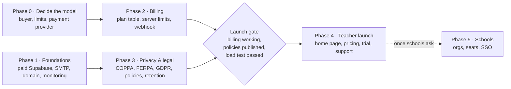

# blurt — Subscription Plan

Oct 5, 2026 · Matthew Higley

> Exported from the shared doc [blurt — Subscription Plan](https://claude.ai/code/artifact/5629cd99-3f70-4b72-a24f-39fe1a7754e1). The doc is the working copy; this file is a snapshot and does not update with it.

blurt becomes a paid product in six phases: decide the model, harden production, build server-enforced billing, clear student-privacy law, launch to individual teachers, then add school licences. The engineering is roughly two to three weeks; the business and compliance work around it is the longer part.

## At a glance

Phases 0 and 1 run side by side, as do 2 and 3; all four must finish before the launch gate, and schools follow only on demand.

## Phase 0 — Decide the model

No code until three choices are made, because each one changes what gets built.

**Goal:** a one-page answer to who pays, what is free, and who takes the money.

**1. Who pays.** Individual teachers paying by card is the simplest start: one checkout, self-serve, monthly or yearly. Schools and districts hold more of the money but buy by purchase order and invoice, want one licence for many teachers, and expect an admin. Recommendation: launch to teachers, and design the plan record so a school licence can own it later (Phase 5).

**2. What is free, what is paid.** Limits must be things the database can count. Candidates:

| Limit | Free tier idea | Paid |
| --- | --- | --- |
| Quizzes | 3 | Unlimited |
| Rooms per month | 5 | Unlimited |
| Players per room | 15 | 40+ |
| Report history | Last 30 days | Everything |
| Paired displays | 1 | Unlimited |
| CSV export | No | Yes |

The numbers are placeholders to argue about, not a recommendation. One rule is fixed: a room that is already running is never cut off for a lapsed payment — it finishes, and the next one is blocked.

**3. Who takes the money.** Stripe (with Stripe Tax for sales tax and VAT) if selling mainly in the US. A merchant of record — Paddle or Lemon Squeezy — if selling internationally from day one: they carry the tax registration and invoicing for a slightly higher fee, which matters for a solo product.

**Done when:** the buyer, the free/paid table and the provider are written down and agreed.

## Phase 1 — Production foundations

People paying for blurt will expect it to be up during a lesson, so the free-tier shortcuts go first. This phase can run alongside Phase 0.

**Goal:** production that does not pause, can send its own email, and tells you when it breaks.

- [ ] **Paid Supabase plan.** The free plan pauses an idle project — that is what took production down on 2 October. Paid also brings daily backups.
- [ ] **Custom SMTP for auth email.** Supabase's built-in sender allows only a few emails an hour; confirmation and reset links stop arriving once a few dozen teachers sign up on the same day. Use a transactional sender (Resend, Postmark or SES).
- [ ] **Own domain** instead of blurt-sepia.vercel.app, and add it to Supabase's redirect allow-list so confirmation and reset links land.
- [ ] **Error monitoring** on the browser app (for example Sentry), so a broken room is seen before a teacher reports it.
- [ ] **Uptime alert** on the site and the Supabase API.
- [ ] **Load test Realtime.** A school might run 10 rooms of 30 phones at once. Run scripts/load-test.mjs at that size and check it against the plan's concurrent-connection limit.
- [ ] **Finish the checks never run.** verify:db's teacher checks are skipped for want of a working test account, and the game sounds have never been heard on a real projector.

**Done when:** the project is on a paid plan, auth email comes from your own sender and domain, alerts reach you, and a 300-phone load test passes.

## Phase 2 — Entitlements and billing

The core build, about two to three weeks. It follows the rule the whole app is built on: anything a browser sends can be tampered with, so a plan is enforced by the database, never by hiding a button.

**Goal:** a teacher can pay, the database knows it, and every limit is checked on the server.

How a payment becomes a permission:

1. The teacher picks a plan from **Plan & billing** in the account menu and is sent to the provider's hosted checkout. No card form is built in blurt.
2. The provider calls a **webhook** — a new server endpoint, either a Vercel Function or a Supabase Edge Function. blurt has no server code of its own today, so this is the first.
3. The webhook verifies the provider's signature and writes the teacher's plan to a new **plan table**, using a secret service key that never reaches a browser. Nothing else can write to that table.
4. The existing database functions read the plan before acting: create\_game for rooms and players, quiz creation for the quiz count, the reports for history, and so on.
5. **Plan & billing** also opens the provider's customer portal, where the teacher changes card, switches monthly/yearly, or cancels — none of that is built in blurt either.

Also in this phase:

- [ ] Migration for the plan table, with the usual checks in scripts/sql: two teachers, one paid and one free, and a forged client call that must be refused.
- [ ] Limit checks in each gated database function, with messages a teacher can act on ("Your free plan includes 3 quizzes").
- [ ] Grace for failed payments: a few days' notice before limits apply, and never mid-room.
- [ ] A trial (14 days of the paid plan is common) without a card.
- [ ] Account deletion that removes the teacher's quizzes, games and every student answer in them; and changing the account email.

**Done when:** a test-mode payment lifts the limits within seconds, a cancellation restores them at period end, and a teacher with devtools cannot raise their own limits.

## Phase 3 — Student privacy and legal

The users' users are children, so this is the biggest non-code item, and schools will ask about it before anything else. Start it during Phase 2; it gates the launch.

**Goal:** published policies a school can approve, and a data-retention rule the app actually enforces.

What blurt already has in its favour: students never make an account, share only a first name and their answers, cannot read anyone else's data, and a teacher can delete past games.

| Area | What it asks of blurt |
| --- | --- |
| COPPA (US, under 13) | Rules for collecting data from children; schools can usually consent on parents' behalf for classroom use |
| FERPA (US) | Student answers may count as education records the school controls; blurt acts on the school's behalf |
| GDPR and the UK Age Appropriate Design Code | Lawful basis, data minimisation, high-privacy defaults for children |
| District privacy agreements | Many US districts require a signed agreement (often the Student Data Privacy Consortium template) before a teacher may use a tool |

- [ ] Privacy policy and terms of service, written for teachers and reviewed by a lawyer who knows education privacy.
- [ ] A data-processing agreement ready to sign for schools.
- [ ] A retention rule — for example, student answers deleted N days after the game — enforced by a scheduled job, not by policy text alone.
- [ ] A list of every service that touches student data (Supabase, Vercel, the email sender, error monitoring) for the policy's sub-processor list.
- [ ] Make sure error monitoring does not capture student names or answers.

**Done when:** the policies are live and linked from the site, the retention job runs, and the agreement is ready to send.

This section describes what each law covers; it is not legal advice.

## Phase 4 — Launch to individual teachers

Open sign-ups once Phases 1–3 are done. The aim is real teachers paying, and learning from them before building for schools.

**Goal:** a stranger can find blurt, understand it, sign up, try it with a class and pay — without talking to you.

- [ ] **A public home page.** The site's front page is the students' join screen today, and must stay one step from a phone. Give pricing and sign-up their own page (for example the domain's root, with joining at /join and the QR codes unchanged) without making a student hunt for the code box.
- [ ] **Pricing page** with the Phase 0 table and a clear trial offer.
- [ ] **First-run help** for a new teacher: the sample quiz, a 60-second "run your first room" guide, the shortcuts sheet.
- [ ] **Billing emails:** receipt, trial ending, payment failed — most come from the provider.
- [ ] **Support route:** an address that reaches you, and a short help page.
- [ ] **A few early teachers first** — a private beta before announcing, with a discount for their feedback.

**Done when:** the first teachers you don't know have paid, and a full lesson has run on a paid account without you watching.

## Phase 5 — Schools and districts

Build this when schools ask for it, not before. It is the largest change to the data model: today every quiz, room and display belongs to exactly one teacher.

**Goal:** a school buys one licence, an admin adds its teachers, and the school pays by invoice.

- [ ] **Organisations:** a school record, its members, and an admin role. The Phase 2 plan record moves from belonging to a teacher to belonging to either a teacher or a school.
- [ ] **Seats:** a licence for N teachers; the admin invites and removes them. A teacher leaving keeps or hands over their quizzes — decide which.
- [ ] **Invoicing and purchase orders:** quotes, net-30 invoices, and paying by bank transfer. Most providers support this; it is mainly process.
- [ ] **Shared quizzes** across a department, if schools ask for it.
- [ ] **Single sign-on** (Google Workspace for Education, Microsoft) — often required by districts, and it replaces passwords for their teachers.
- [ ] **Admin view:** usage across the school, for the person renewing the licence.

**Done when:** one school is on a licence, paid by invoice, with its teachers managed by its own admin.

## Open questions

These need an answer before Phase 2 starts.

- [ ] Teachers first, or straight to schools?
- [ ] Which limits are paid, and at what numbers?
- [ ] Price, and is there a yearly discount?
- [ ] US only at launch, or international (Stripe vs a merchant of record)?
- [ ] How long are student answers kept before automatic deletion?
- [ ] Is light/dark, the doodle wall or the music part of the paid plan, or free for everyone?
- [ ] What happens to a lapsed teacher's quizzes and reports — kept read-only, or deleted after a time?
